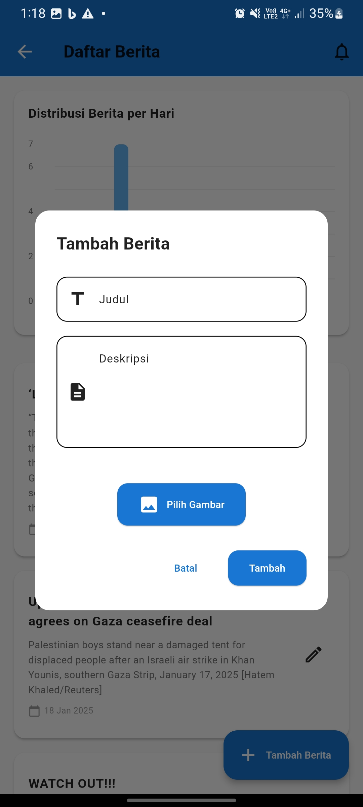

# FLEX---Fresh-Latest-Exclusive---Server-Side
FLEX adalah aplikasi berita modern yang menyediakan informasi terbaru dari berbagai sumber, dilengkapi dengan grafik interaktif dan notifikasi realtime.
## Tangkapan Layar




## Fitur
- CRUD berita dengan Firebase Firestore
- Grafik distribusi berita menggunakan `fl_chart`
- Notifikasi realtime dengan Firebase Cloud Messaging (FCM)
- Tampilan responsif dan intuitif
- Integrasi data dari API publik

## Instalasi
1. Clone repositori ini:
   ```bash
   git clone https://github.com/username/FLEX.git
   cd FLEX
   flutter pub get
   *Tambahkan file google-services.json (untuk Android) dan GoogleService-Info.plist (untuk iOS) di direktori proyek.*
   flutter run

## Tim Pengembang
- Dimas Bratakusumah (Backend Developer)
- Figo (Frontend Developer)

## Demo
[Klik di sini untuk melihat demo aplikasi](https://youtu.be/7RgYnB9y8Ak)
